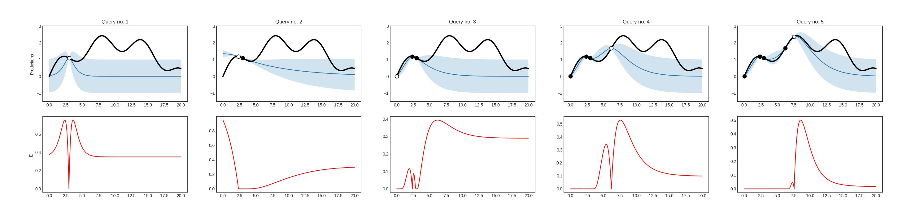
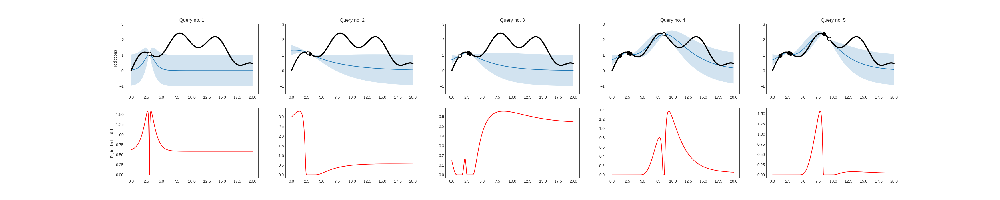
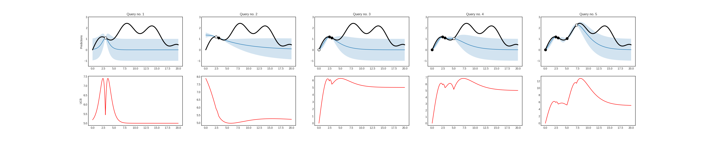

# Bayesian optimization

When a function is expensive to evaluate, or when gradients are not available, optimalizing it requires more sophisticated methods than gradient descent. One such method is Bayesian optimization, which lies close to active learning. In Bayesian optimization, instead of picking queries by maximizing the uncertainty of predictions, function values are evaluated at points where the promise of finding a better value is large. In modAL, these algorithms are implemented with the ```BayesianOptimizer``` class, which is a sibling of ```ActiveLearner```. In the following example, their use is demonstrated on a toy problem.

## The function to be optimized

We are going to optimize a simple function to demonstrate the use of ```BayesianOptimizer```.

```python
import numpy as np

# generating the data
X = np.linspace(0, 20, 1000).reshape(-1, 1)
y = np.sin(X)/2 - ((10 - X)**2)/50 + 2
```

This function looks like the following.


## Gaussian processes
In Bayesian optimization, usually a Gaussian process regressor is used to predict the function to be optimized. One reason is that Gaussian processes can estimate the uncertainty of the prediction at a given point. This in turn can be used to estimate the possible gains at the unknown points.
```python
# assembling initial training set
X_initial, y_initial = X[150].reshape(1, -1), y[150].reshape(1, -1)

# defining the kernel for the Gaussian process
from sklearn.gaussian_process import GaussianProcessRegressor
from sklearn.gaussian_process.kernels import Matern

kernel = Matern(length_scale=1.0)
regressor = GaussianProcessRegressor(kernel=kernel)
```

## Optimizing using *expected improvement*
During the optimization, the utility of each point is given by the so-called *acquisition function*. In this case, we are going to use the *expected improvement*, which is defined by
<p align="center">$$ EI(x) = (\mu(x) - f(x^+)) \psi\Big( \frac{\mu(x) - f(x^+)}{\sigma(x)} \Big) + \sigma(x) \phi\Big( \frac{\mu(x) - f(x^+)}{\sigma(x)} \Big), $$ </p><br>
where $$ \mu(x) $$ and $$ \sigma(x) $$ are the mean and variance of the Gaussian process regressor at $$ x $$, $$ f $$ is the function to be optimized with estimated maximum at $$ x^+ $$, and $$ \psi(z) $$, $$ \phi(z) $$ denotes the cumulative distribution function and density function of a standard Gaussian distribution. After each query, the acquisition function is reevaluated and the new query is chosen to maximize the acquisition function. 

```python
# initializing the optimizer
from modAL.models import BayesianOptimizer
from modAL.acquisition import max_EI

optimizer = BayesianOptimizer(
    estimator=regressor,
    X_training=X_initial, y_training=y_initial,
    query_strategy=max_EI
)

# Bayesian optimization
for n_queries in range(4):
    query_idx, query_inst = optimizer.query(X)
    optimizer.teach(X[query_idx].reshape(1, -1), y[query_idx].reshape(1, -1))
```

Using *expected improvement*, the first five queries are the following.


Of course, there are other acquisition functions out there. The *probability of improvement* and the *upper confidence bound* are presented below for this problem.



If you would like to experiment, check out this [runnable example](https://github.com/cosmic-cortex/modAL/blob/master/examples/bayesian_optimization.py) included in modAL! For a tutorial on Bayesian optimization, see [this paper](https://arxiv.org/abs/1012.2599)!

