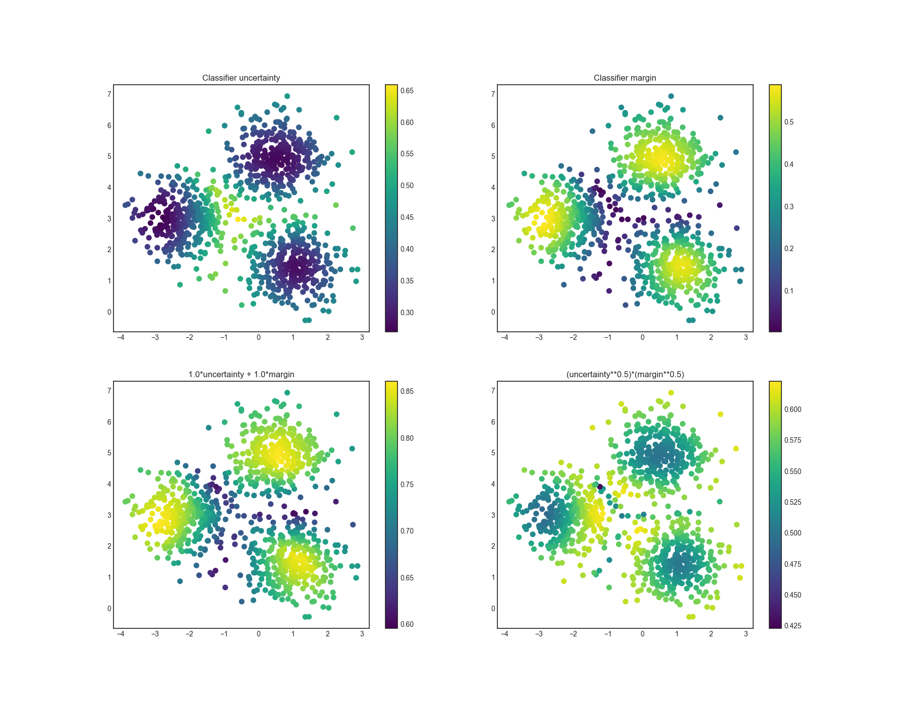

# Extending modAL
modAL was designed for researchers, allowing quick and efficient prototyping. For this purpose, modAL makes it easy for you to use your customly designed parts, for instance query strategies or new classifier algorithms.

## Page contents
- [Writing your own query strategy](#query-strategy)  
- [Building blocks of query strategies](#building-blocks)  
  - [Utility measures](#utility-measures)  
  - [Linear combinations and products](#combinators)  
  - [Selectors](#selectors)  
  - [Putting them together](#putting-them-together)  
- [Using your custom estimators](#custom-estimators)  

# Writing your own query strategy<a name="query-strategy"></a>
In modAL, a query strategy for active learning is implemented as a function, taking an estimator and a bunch of data, turning it into an instance from the data you supplied to it. Exactly like in the following.
```python
def some_query_strategy(classifier, X, a_keyword_argument=42):
    proba = classifier.predict_proba(X)
    # ...
    # ... do some magic and find the most informative instance ...
    # ...
    return query_idx, X[query_idx]
```
Putting this to work is as simple as the following.
```python
from modAL.models import ActiveLearner
from sklearn.ensemble import RandomForestClassifier

# initializing the learner
learner = ActiveLearner(
    estimator=RandomForestClassifier(),
    query_strategy=some_query_strategy
)

# querying for labels
query_idx, query_instance = learner.query(X)
```
For a practical example, see for instance this [active regression](Active-regression).

# Building blocks of query strategies<a name="building-blocks"></a>

To build more elaborate query strategies, many building blocks are available. In the following, we are going to take a look how can you combine already existing or custom utility measures with each other.

The two main components of a query strategy are the utility measure and the query selector. From an abstract viewpoint, this is how a query strategy looks like.
```python
def custom_query_strategy(classifier, X, a_keyword_argument=42):
    # measure the utility of each instance in the pool
    utility = utility_measure(classifier, X)

    # select the indices of the instances to be queried
    query_idx = select_instances(utility)

    # return the indices and the instances
    return query_idx, X[query_idx]
```

## Utility measures<a name="utility-measures"></a>
The soul of a query strategy is the utility measure. A utility measure takes a pool of examples (and frequently but optionally an estimator object) and returns a one dimensional array containing the utility score for each example. For instance, ```classifier_uncertainty```, ```classifier_margin``` and ```classifier_entropy``` from ```modAL.uncertainty``` are utility measures which you can use. You can also implement your own or you can take linear combinations and products, as we shall see next.

## Linear combinations and products<a name="combinators"></a>
One way of creating new utility measures is to take linear combinations or products of already existing ones. For this, the function factories in the module ```modAL.utils.combination``` are there to help!

```python
from modAL.utils.combination import make_linear_combination, make_product
from modAL.uncertainty import classifier_uncertainty, classifier_margin

# creating new utility measures by linear combination and product
# linear_combination will return 1.0*classifier_uncertainty + 1.0*classifier_margin
linear_combination = make_linear_combination(
    classifier_uncertainty, classifier_margin,
    weights=[1.0, 1.0]
)
# product will return (classifier_uncertainty**0.5)*(classifier_margin**0.1)
product = make_product(
    classifier_uncertainty, classifier_margin,
    exponents=[0.5, 0.1]
)
```

To use ```make_linear_combination``` and ```make_product```, you must supply functions taking the same arguments!

The newly generated utility measures are demonstrated in the following figure.
<p align="center">
  
</p>

## Selectors<a name="selectors"></a>
After the individual utility scores are calculated, a query strategy must determine which instances are to be queried. Two prebuilt selectors are available in ```modAL.utils.selection```: ```multi_argmax(values, n_instances=1)``` selects the ```n_instances``` highest utility score, while ```weighted_random(weights, n_instances=1)``` selects the instances by random, using the supplied weighting.

## Putting them together<a name="putting-them-together"></a>
When the components are given, putting the query strategy together is really simple.

```python
def custom_query_strategy(classifier, X, n_instances=1):
    utility = linear_combination(classifier, X)
    query_idx = multi_argmax(utility, n_instances=n_instances)
    return query_idx, X[query_idx]
```

This can be used immediately in the active learning workflow!

# Using your custom estimators<a name="custom-estimators"></a>
As long as your classifier follows the scikit-learn API, you can use it in your modAL workflow. (Really, all it needs is a ```.fit(X, y)``` and a ```.predict(X)``` method.) For instance, the ensemble model implemented in Committee can be given to an ActiveLearner.
```python
# initializing the learners
n_learners = 3
learner_list = []
for _ in range(n_learners):
    learner = ActiveLearner(
        estimator=RandomForestClassifier(),
        X_training=X_training, y_training=y_training,
        bootstrap_init=True
    )
    learner_list.append(learner)

# assembling the Committee
committee = Committee(learner_list)

# ensemble active learner from the Committee
ensemble_learner = ActiveLearner(
    estimator=committee
)
```
Now you are ready for active learning with an ensemble of classifiers! If you would like to keep bagging the data pass ```bootstrap=True``` to the ```.teach()``` method!
