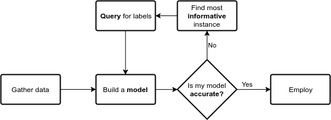

# modAL
Modular Active Learning framework for Python3

## Introduction
ModAL is an active learning framework for Python3, designed with
*modularity, flexibility* and *extensibility* in mind. Built on top of
scikit-learn, it allows you to rapidly create active learning workflows
with nearly complete freedom. What is more, you can easily replace parts
with your custom built solutions, allowing you to design novel
algorithms with ease.

## Active learning from bird's-eye view
Let's take a look at a general active learning workflow!



The key components of any workflow are the **model** you choose, the
**information** measure you use and the **query** strategy you apply to
request labels. With modAL, instead of choosing from a small set of
built-in classifiers, you have the freedom to employ *any* estimator
from scikit-learn and you can easily tailor custom query strategies and
information measures.

## The first example
Uncertainty sampling with a Random Forest Classifier can be as simple as
the following.

```python
from sklearn.ensemble import RandomForestClassifier
from modAL.models import ActiveLearner
from modAL.utilities import classifier_uncertainty

# initializing the learner
learner = ActiveLearner(
    predictor=RandomForestClassifier(), utility_function=classifier_uncertainty,
    training_data=X_train, training_labels=y_train
)

# the active learning loop
for loop_idx in range(n_loops):
    query_idx, query_inst = learner.query(X_pool)
    learner.add_and_retrain(X_pool[query_idx], y_pool[query_idx])
```
