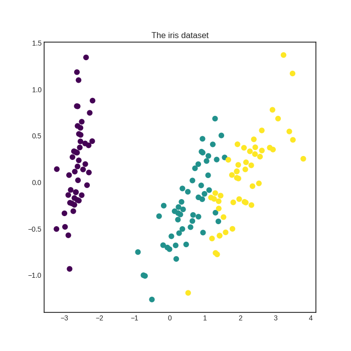
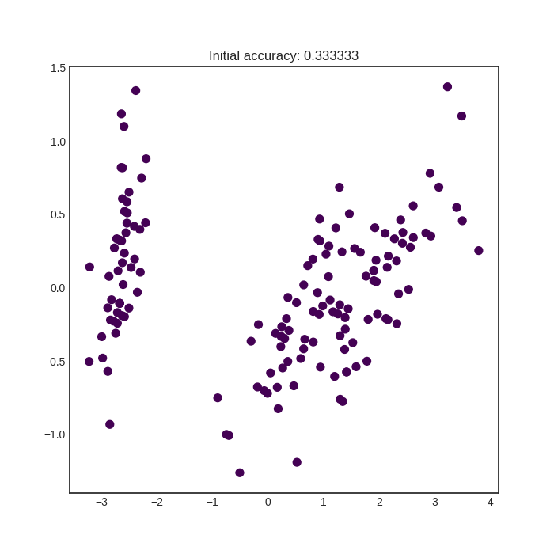

# Pool-based sampling
One of the most well known settings for active learning is pool-based sampling. In this case, a pool of unlabelled instances are given to the active learner, which measures how well can it classify each example. Based upon this measurement, a utility score is generated. For instance, uncertain examples achieve high score and where the classification is certain, a low score is assigned. Labels are then requested for the most informative instances from an expert and these new labels are used to improve the model. In this example, this scenario is demonstrated on the famous iris dataset.

The executable script for this example is [available here!](https://github.com/cosmic-cortex/modAL/blob/master/examples/pool-based_sampling.py)

## The dataset
We are going to use the iris dataset for this example. For more information on the iris dataset, see [its wikipedia page](https://en.wikipedia.org/wiki/Iris_flower_data_set). For its scikit-learn interface, see [the scikit-learn documentation](http://scikit-learn.org/stable/modules/generated/sklearn.datasets.load_iris.html).

```python
# loading the iris dataset
iris = load_iris()

# initial training data
train_idx = [0, 50, 100]
X_train = iris['data'][train_idx]
y_train = iris['target'][train_idx]

# generating the pool
X_pool = np.delete(iris['data'], train_idx, axis=0)
y_pool = np.delete(iris['target'], train_idx)
```

If you perform a PCA on the iris dataset, here is how it looks like:



## Active learning
After the initial training data and the pool are generated, we are ready to do active learning!
```python
# initializing the active learner
learner = ActiveLearner(
    predictor=KNeighborsClassifier(n_neighbors=3),
    X_initial=X_train, y_initial=y_train
)
```
Before the active learning loop, here is how the predictions look like.



In this example, we will do 20 queries using maximum uncertainty sampling.
```python
# pool-based sampling
n_queries = 20
for idx in range(n_queries):
    query_idx, query_instance = learner.query(X_pool)
    learner.teach(
        X=X_pool[query_idx].reshape(1, -1),
        y=y_pool[query_idx].reshape(1, )
    )
    # remove queried instance from pool
    X_pool = np.delete(X_pool, query_idx, axis=0)
    y_pool = np.delete(y_pool, query_idx)
```
After the queries, the predicitions are much better:


