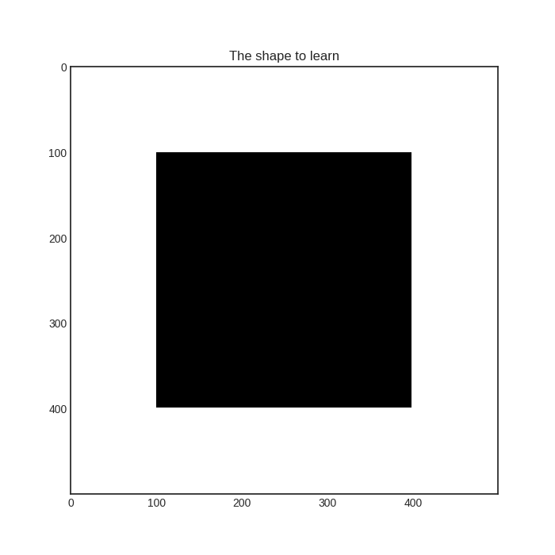

# Stream-based sampling
In addition to pool-based sampling, the stream-based scenario can also be implemented easily with modAL. In this case, the labels are not queried from a pool of instances. Rather, they are given one-by-one for the learner, which queries for its label if it finds the example useful. For instance, an example can be marked as useful if the prediction is uncertain, because acquiring its label would remove this uncertainty. 

The executable script for this example can be [found here!](https://github.com/cosmic-cortex/modAL/blob/master/examples/stream-based_sampling.py)

## The dataset
In this example, we are going to learn a black square on a white background. We are going to use a random forest classifier in a stream-based setting. First, let's generate some data!

```python
# creating the image
im_width = 500
im_height = 500
im = np.zeros((im_height, im_width))
im[100:im_width - 1 - 100, 100:im_height - 1 - 100] = 1

# create the data to stream from
X_full = np.transpose(
    [np.tile(np.asarray(range(im.shape[0])), im.shape[1]),
     np.repeat(np.asarray(range(im.shape[1])), im.shape[0])]
)
# map the intensity values against the grid
y_full = np.asarray([im[P[0], P[1]] for P in X_full])
```

In case you are wondering, here is how this looks like!


## Active learning
Initializing the learner is the same as always.
```python
>>> # assembling initial training set
>>> n_initial = 5
>>> initial_idx = np.random.choice(range(len(X_full)), size=n_initial, replace=False)
>>> X_train, y_train = X_full[initial_idx], y_full[initial_idx]
>>> 
>>> # initialize the learner
>>> learner = ActiveLearner(
>>>     predictor=RandomForestClassifier(),
>>>     X_initial=X_train, y_initial=y_train
>>> )
>>> print('Initial prediction accuracy: %f' % learner.score(X_full, y_full))
>>>
... Initial prediction accuracy: 0.410244
```
This is how the class prediction probabilities look like for each pixel.


Now we are going to randomly sample pixels from the image. If the prediction of the pixel's value is uncertain, we query the true value and teach it to the classifier. We are going to do this until we reach at least 90% accuracy.
```python
>>> # learning until the accuracy reaches a given threshold
>>> while learner.score(X_full, y_full) < 0.90:
>>>     stream_idx = np.random.choice(range(len(X_full)))
>>>     if classifier_uncertainty(learner, X_full[stream_idx].reshape(1, -1)) >= 0.4:
>>>         learner.teach(X_full[stream_idx].reshape(1, -1), y_full[stream_idx].reshape(-1, ))
>>>         print('Pixel no. %d queried, new accuracy: %f' % (stream_idx, learner.score(X_full, y_full)))
>>> 
... Pixel no. 83428 queried, new accuracy: 0.551316
... Pixel no. 170935 queried, new accuracy: 0.491884
... Pixel no. 159529 queried, new accuracy: 0.570128
... Pixel no. 170628 queried, new accuracy: 0.735812
... Pixel no. 41672 queried, new accuracy: 0.785508
... Pixel no. 158656 queried, new accuracy: 0.703844
... Pixel no. 170505 queried, new accuracy: 0.737596
... Pixel no. 248886 queried, new accuracy: 0.741332
... Pixel no. 219077 queried, new accuracy: 0.810620
... Pixel no. 181856 queried, new accuracy: 0.820960
... Pixel no. 215676 queried, new accuracy: 0.850944
... Pixel no. 65082 queried, new accuracy: 0.818608
... Pixel no. 116893 queried, new accuracy: 0.860196
... Pixel no. 33343 queried, new accuracy: 0.809160
... Pixel no. 82664 queried, new accuracy: 0.901644
```
As you can see, prediction accuracy can deteriorate after a query, but on the long run, it should get better. (Though this is not always the case with uncertainty-based sampling.) Here are the prediction probabilities after a few queries:

