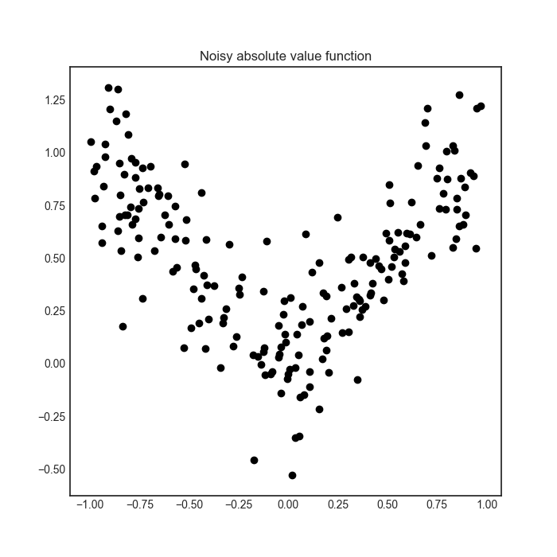

Active regression with Committee
================================

With an ensemble of regressors, the standard deviation of the predictions at a given point can be thought of as a measure of
disagreement. This can be used for active regression. In the following example, we are going to see how can it be done using the
CommitteeRegressor class. 

The executable script for this example can be `found here! <https://github.com/cosmic-cortex/modAL/blob/master/examples/ensemble_regression.py>`__

The dataset
-----------

For the sake of this example, we are going to learn the *noisy absolute value* function.

.. code:: python

    import numpy as np

    X = np.concatenate((np.random.rand(100)-1, np.random.rand(100)))
    y = np.abs(X) + np.random.normal(scale=0.2, size=X.shape)

Measuring disagreement with CommitteeRegression
-----------------------------------------------

If you have several regressors, measuring disagreement can be done by calculating the standard deviation of the predictions for each point. This of course cannot be achieved with classifier algorithms, where averaging the class labels doesn't make sense. (Or it is undefined even, if the class labels are strings for example.) In the simplest setting, this is implemented in the function ``modAL.disagreement.max_std_sampling``.

This measure is default for CommitteeRegressors, so we don't need to specify this upon initialization.

Active regression
-----------------

With an ensemble of regressors, it can happen that each one explains part of your data particularly well, while doing poorly on the rest. In our case, it can happen when one of them only seen negative numbers and the other only seen positive ones.

.. code:: python

    from modAL.models import ActiveLearner, CommitteeRegressor
    from modAL.disagreement import max_std_sampling
    from sklearn.gaussian_process import GaussianProcessRegressor
    from sklearn.gaussian_process.kernels import WhiteKernel, RBF

    # initializing the regressors
    n_initial = 10
    kernel = RBF(length_scale=1.0, length_scale_bounds=(1e-2, 1e3)) \
             + WhiteKernel(noise_level=1, noise_level_bounds=(1e-10, 1e+1))

    initial_idx = list()
    initial_idx.append(np.random.choice(range(100), size=n_initial, replace=False))
    initial_idx.append(np.random.choice(range(100, 200), size=n_initial, replace=False))
    learner_list = [ActiveLearner(
                            estimator=GaussianProcessRegressor(kernel),
                            X_training=X[idx].reshape(-1, 1), y_training=y[idx].reshape(-1, 1)
                    )
                    for idx in initial_idx]

    # initializing the Committee
    committee = CommitteeRegressor(
        learner_list=learner_list,
        query_strategy=max_std_sampling
    )

This is demonstrated in the figure below, where the transparent blue region represents the standard deviation of the predictions, which is our disagreement measure.

.. image:: img/er-initial.png
   :align: center
   
After a few queries, the differences are smoothed out and the regressors
reach an agreement.

.. code:: python

    # active regression
    n_queries = 10
    for idx in range(n_queries):
        query_idx, query_instance = committee.query(X.reshape(-1, 1))
        committee.teach(X[query_idx].reshape(-1, 1), y[query_idx].reshape(-1, 1))

.. image:: img/er-final.png
   :align: center
