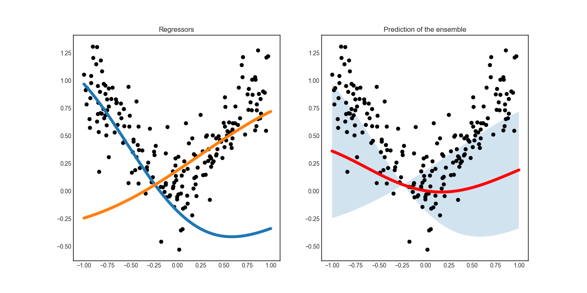

CommitteeRegressor
==================

In addition to committee based active learning for classification, modAL also implements committee based regression. This is done with the CommitteeRegressor class.

Differences between Committee and CommitteeRegressor
----------------------------------------------------

From an API viewpoint, there are two main differences between the CommitteeRegressor and the Committee classes. First, CommitteeRegressor doesn't have ``.vote_proba()`` and ``.predict_proba()`` methods, since regressors in general doesn't provide a way to estimate the probability of correctness. (One notable exception is the Gaussian process regressor.)

The other main difference is that now you can pass the argument ``return_std=True`` for the method ``.predict()``, which in this case
will return the standard deviation of the prediction. This follows the scikit-learn API for those regressor objects which the standard deviation can be calculated.

Measuring disagreement
----------------------

With an ensemble of regressors like in the CommitteeRegressor model, a measure of disagreement can be the standard deviation of predictions, which provides a simple way to query for labels. This is not the case in general: for ordinary regressors, it is difficult to come up with viable query strategies because they don't always provide a way to measure uncertainty. (One notable exception is the Gaussian process regressor.)

This is demonstrated in `this example <../examples/Ensemble-regression.html>`__, where two regressors are trained on distinct subsets of the same dataset. In the figure below, the regressors are shown along with the mean predictions and the standard deviation.

