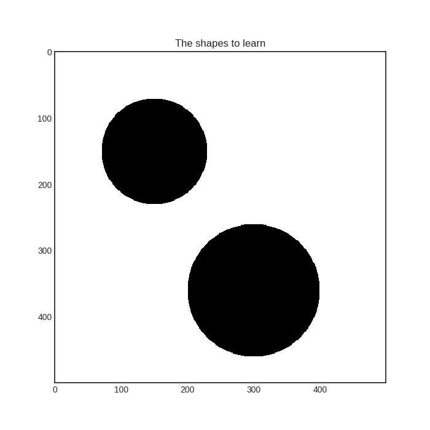

.. _Disagreement-sampling:

Disagreement sampling
=====================

When you have several hypotheses about your data, selecting the next instances to label can be done by measuring the disagreement between the hypotheses. Naturally, there are many ways to do that. In modAL, there are three built-in disagreement measures and query strategies: *vote entropy*, *consensus entropy* and *maximum disagreement*. In this quick tutorial, we are going to review them. For more details, see Section 3.4 of the awesome book `Active learning by Burr Settles <http://active-learning.net/>`__.

Disagreement sampling for classifiers
-------------------------------------

Committee-based models in modAL come in two flavors: Committee for classifiers and CommitteeRegressor for regressors. First, let's take a look at disagreement-based sampling strategies for classification!

Vote entropy
^^^^^^^^^^^^

Suppose that you have a Committee of three classifiers, classes ``[0, 1, 2]`` and five instances to classify. If you would like to
calculate the vote entropy, first you ask every classifier about its prediction:

.. code:: python

    >>> vote
    ... [[0, 1, 0]
    ...  [1, 1, 2]
    ...  [0, 1, 2]
    ...  [2, 2, 2]
    ...  [1, 2, 2]]

Each instance has a corresponding probability distribution to it: the distribution of class labels when picking a classifier by random. In the first instance, there are two votes for ``0``, one votes for ``1`` and zero votes for ``2``. In this case, this distribution is ``[0.6666, 0.3333, 0.0]``. The distributions for all instances are

.. code:: python

    >>> p_vote
    ... [[0.6666, 0.3333, 0.0   ]
    ...  [0.0   , 0.6666, 0.3333]
    ...  [0.3333, 0.3333, 0.3333]
    ...  [0.0   , 0.0   , 1.0   ]
    ...  [0.0   , 0.3333, 0.6666]]

Vote entropy selects the instance for which the entropy of this vote distribution is the largest. In this case, the vote entropies are

.. code:: python

    >>> vote_entropy
    ... [0.6365, 0.6365, 1.0986, 0.0, 0.6365]

Since all three votes are different for the third instance, the entropy is the largest there, thus a vote entropy based query strategy would choose that one.

Consensus entropy
^^^^^^^^^^^^^^^^^

Instead of calculating the distribution of the votes, the *consensus
entropy* disagreement measure first calculates the average of the class
probabilities of each classifier. This is called the consensus
probability. Then the entropy of the consensus probability is calculated
and the instance with the largest consensus entropy is selected.

For an example, let's suppose that we continue the previous example with
three classifiers, classes ``[0, 1, 2]`` and five instances to classify.
For each classifier, the class probabilities are

.. code:: python

    >>> vote_proba
    ... [[[0.8, 0.1, 0.0]    # \
    ...   [0.3, 0.7, 0.0]    # |
    ...   [1.0, 0.0, 0.0]    # |  <-- class probabilities for the first classifier
    ...   [0.2, 0.2, 0.6]    # |
    ...   [0.2, 0.7, 0.1]],  # /
    ...  [[0.0, 1.0, 0.0]    # \
    ...   [0.4, 0.6, 0.0]    # |
    ...   [0.2, 0.7, 0.1]    # |  <-- class probabilities for the second classifier
    ...   [0.3, 0.1, 0.6]    # |
    ...   [0.0, 0.0, 1.0]],  # /
    ...  [[0.7, 0.2, 0.1]    # \
    ...   [0.4, 0.0, 0.6]    # |
    ...   [0.3, 0.2, 0.5]    # |  <-- class probabilities for the third classifier
    ...   [0.1, 0.0, 0.9]    # |
    ...   [0.0, 0.1, 0.9]]]  # /

In this case, the consensus probabilities are

.. code:: python

    >>> consensus_proba
    ... [[0.5   , 0.4333, 0.0333]
    ...  [0.3666, 0.4333, 0.2   ]
    ...  [0.5   , 0.3   , 0.2   ]
    ...  [0.2   , 0.1   , 0.7   ]
    ...  [0.0666, 0.2666, 0.6666]]

The entropy of this is

.. code:: python

    >>> consensus_entropy
    ... [0.8167, 1.0521, 1.0296, 0.8018, 0.8033]

Even though the votes for the second instance are ``[1, 1, 2]``, since the classifiers are quite unsure, thus the consensus entropy is high. In this case, the query strategy would select the second example to be labelled by the Oracle.

Max disagreement
^^^^^^^^^^^^^^^^

The disagreement measures so far take the actual *disagreement* into account in a weak way. Instead of this, it is possible to measure each learner's disagreement with the consensus probabilities and query the instance where the disagreement is largest for some learner. This is called *max disagreement sampling*. Continuing our example, if the vote probabilities for each learner and the consensus probabilities are given, we can calculate the `Kullback-Leibler divergence <https://en.wikipedia.org/wiki/Kullback%E2%80%93Leibler_divergence>`__ of each learner to the consensus prediction and then for each instance, select the largest value.

.. code:: python

    >>> for i in range(5):
    >>>     for j in range(3):
    >>>         learner_KL_div[i, j] = entropy(vote_proba[j, i], qk=consensus_proba[i])
    >>>
    >>> learner_KL_div
    ... [[0.32631363,  0.80234647,  0.15685227],
    ...  [0.27549995,  0.23005799,  0.69397192],
    ...  [0.69314718,  0.34053564,  0.22380466],
    ...  [0.04613903,  0.02914912,  0.15686827],
    ...  [0.70556709,  0.40546511,  0.17201121]]
    >>>
    >>> max_disagreement
    ... [0.80234647,  0.69397192,  0.69314718,  0.15686827,  0.70556709]

In this case, one of the learner highly disagrees with the others in the class of the first instance. Thus, the max disagreement sampling would choose this one to be labelled by the Oracle.

Disagreement sampling for regressors
------------------------------------

Since regressors, in general, don't provide a way to calculate prediction probabilities, disagreement measures for classifiers may not work with regressors. Despite this, ensemble regression models can be always used in an active learning scenario, because the standard deviation of the predictions at a given point can be thought of as a measure of disagreement.

Standard deviation sampling
^^^^^^^^^^^^^^^^^^^^^^^^^^^

.. figure:: img/er-initial.png
   :align: center

When a committee of regressors is available, the uncertainty of predictions can be estimated by calculating the standard deviation of predictions. This is done by the ``modAL.disagreement.max_std_sampling`` function.

Disagreement measures in action
-------------------------------

To visualize the disagreement measures, let's consider a toy example! Suppose that we would like to learn these two objects:

We train two random forest classifiers:

.. figure:: img/dis-learners.png
   :align: center

The consensus predictions of these learners are

.. figure:: img/dis-consensus.png
   :align: center

In this case, the disagreement measures from left to right are vote entropy, consensus entropy, and max disagreement.

.. figure:: img/dis-measures.png
   :align: center
